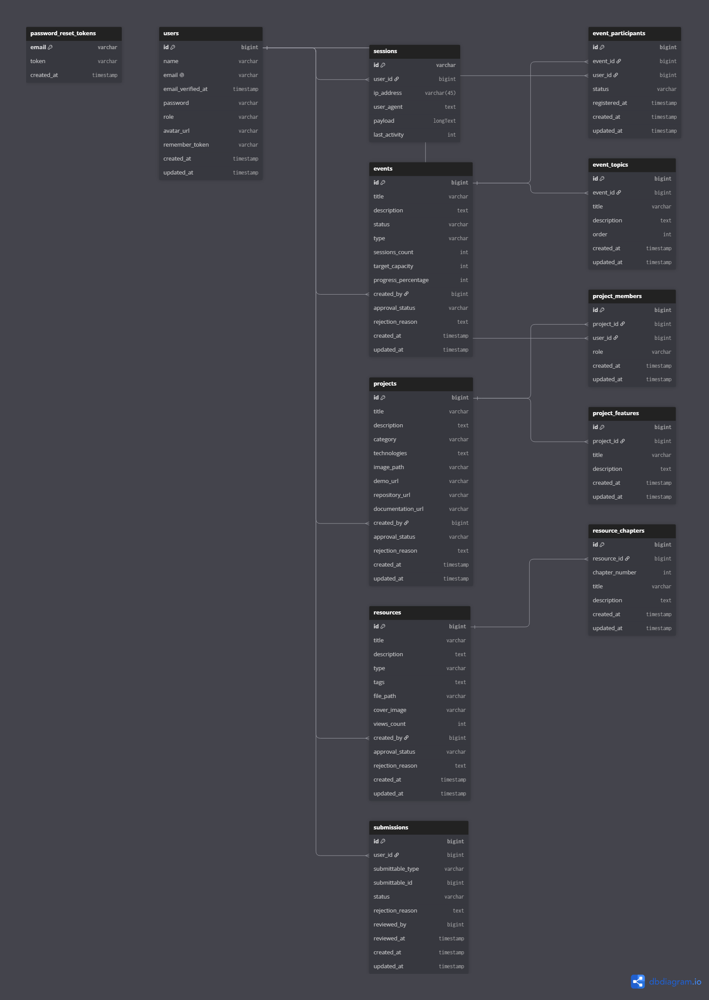

# Progress Hub

A **polyglot monorepo** for managing the Progress Hub platform — a community platform for UKM (student organization) events, projects, and learning resources.

## Project Structure

```
progress-hub/
├── apps/
│   ├── landing/        # Marketing & landing page (Next.js 16 + Tailwind CSS v4)
│   └── website/        # Main application (Laravel 13 + Tailwind CSS v4)
├── docker/             # Docker configurations
├── docs/               # Documentation & ERD
├── scripts/            # Utility scripts
└── .github/            # CI/CD workflows
```

## Tech Stack

| App | Stack |
|---|---|
| **Landing** | Next.js 16, React 19, Tailwind CSS v4, shadcn/ui, Framer Motion |
| **Website** | Laravel 13, PHP 8.3+, Blade Templates, Tailwind CSS v4, Vite, MySQL |

## Entity Relationship Diagram



### Database Tables

- **`users`** — Member and admin accounts (`role: 'admin' | 'member'`)
- **`events`** — Workshops, classes, hackathons, and seminars
- **`event_topics`** — Syllabus outline per event (1:N)
- **`event_participants`** — Member registration tracking (M:N pivot)
- **`projects`** — Student, UKM, and community projects
- **`project_members`** — Team member roles per project (M:N pivot)
- **`project_features`** — Key features per project (1:N)
- **`resources`** — Educational materials, articles, and tools
- **`resource_chapters`** — Chapter breakdown per resource (1:N)
- **`submissions`** — Member content submissions for admin approval (polymorphic)

## Getting Started

### Prerequisites

- [PHP](https://php.net/) >= 8.3
- [Composer](https://getcomposer.org/) >= 2.x
- [Node.js](https://nodejs.org/) >= 18.x
- MySQL

### Setup

```bash
# Clone the repository
git clone <repository-url>
cd progress-hub

# Website setup
cd apps/website
composer install
npm install
cp .env.example .env
php artisan key:generate
php artisan migrate --seed
composer run dev

# Landing setup
cd ../landing
npm install
npm run dev
```

### Default Accounts

| Role | Email | Password |
|---|---|---|
| Admin | `admin@progresshub.com` | `password` |
| Member | `ahmadfauzi@example.com` | `password` |

## CI/CD

GitHub Actions with path-based filtering:
- Changes to `apps/website/**` trigger website builds
- Changes to `apps/landing/**` trigger landing builds

## License

[MIT](LICENSE)
