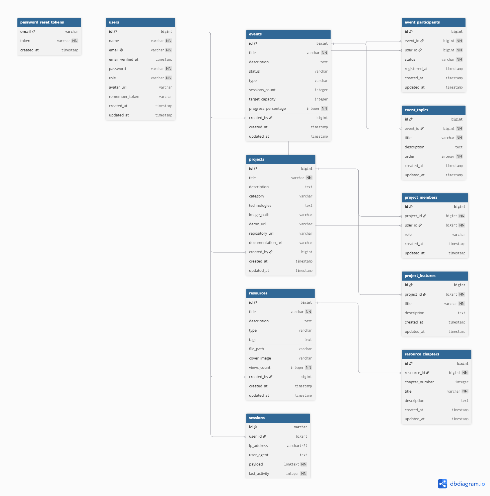

# Progress Hub

**Progress Hub** is an integrated community platform designed for managing events, showcasing member and organizational projects, and sharing curated learning resources. Built with **Laravel 13**, **Tailwind CSS v4**, and **Vite**.

---

## Database Schema & ERD

Below is the Entity Relationship Diagram (ERD) representing the database structure and relationships within **Progress Hub**:



### Core Domain Entities & Relationships

- **`users`**: Manages member and administrator accounts (`role: 'admin' | 'member'`).
- **`events`**: Handles workshops, classes, hackathons, and seminars. Includes sessions, progress percentage, and capacity tracking.
  - **`event_topics`**: Topics and syllabus outline for each event (`1 : N` with `events`).
  - **`event_participants`**: Tracks member registration and participation status (`M : N` pivot between `users` and `events`).
- **`projects`**: Showcases student, UKM, and community projects with repository, demo, and documentation links.
  - **`project_members`**: Assigns users and their roles (e.g., Lead, Frontend, Backend) to projects (`M : N` pivot between `users` and `projects`).
  - **`project_features`**: Highlights key features for each project (`1 : N` with `projects`).
- **`resources`**: Educational materials, articles, development tools, and modules.
  - **`resource_chapters`**: Detailed chapter breakdown for structured learning modules (`1 : N` with `resources`).

---

## Features

- **Authentication & Authorization**: Role-based access control (`admin` and `member`).
- **Event Management**:
  - Admin: Create, update, and manage events, topics, and capacities.
  - Member: Browse upcoming events, view agendas, and toggle event registrations.
- **Project Showcase**:
  - Showcase UKM and member-driven projects.
  - Detailed feature breakdown, tech stack badges, and live demo / repository links.
  - Team member attribution with specific roles.
- **Learning Resource Hub**:
  - Structured modules, articles, and guides with chapter navigation.
  - View counts, tagging, and download support.
- **Dashboards**:
  - **Member Dashboard**: Overview of registered events, bookmarked resources, and active projects.
  - **Admin Panel**: Centralized management for all platform resources.

---

## Tech Stack

- **Backend**: [PHP 8.3+](https://php.net), [Laravel 13.x](https://laravel.com)
- **Frontend**: [Blade Templates](https://laravel.com/docs/blade), [Tailwind CSS v4](https://tailwindcss.com), [Vite](https://vitejs.dev)
- **Database**: MySQL / PostgreSQL / SQLite
- **Testing**: [Pest PHP](https://pestphp.com)

---

## Getting Started

### Prerequisites

Make sure you have the following installed:
- **PHP** >= 8.3 (with `pdo`, `mbstring`, `openssl`, `tokenizer`, `xml`, `ctype`, `json`, `bcmath` extensions)
- **Composer** >= 2.x
- **Node.js** >= 18.x & **npm**

### Installation

1. **Clone the repository**:
   ```bash
   git clone <repository-url>
   cd progress-hub
   ```

2. **Install PHP and Node dependencies**:
   ```bash
   composer install
   npm install
   ```

3. **Configure Environment**:
   ```bash
   cp .env.example .env
   php artisan key:generate
   ```

4. **Set Up Database**:
   Configure your database credentials in `.env`, then run migrations and seed sample data:
   ```bash
   php artisan migrate --seed
   ```

5. **Run the Development Server**:
   Run all services concurrently:
   ```bash
   composer run dev
   ```
   Or start the Laravel server and Vite build process separately:
   ```bash
   # Terminal 1
   php artisan serve

   # Terminal 2
   npm run dev
   ```

6. Open your browser and navigate to `http://127.0.0.1:8000`.

---

## Default Seeded Accounts

When you run `php artisan migrate --seed`, the following demo accounts are created:

| Role | Email | Password |
| :--- | :--- | :--- |
| **Admin** | `admin@progresshub.com` | `password` |
| **Member** | `ahmadfauzi@example.com` | `password` |
| **Member** | `budisantoso@example.com` | `password` |
| **Member** | `citradewi@example.com` | `password` |

---

## Project Structure

```text
progress-hub/
├── app/
│   ├── Http/Controllers/    # Application controllers (Auth, Admin, Members)
│   ├── Http/Middleware/     # Custom middleware (RoleMiddleware)
│   └── Models/              # Eloquent models (User, Event, Project, Resource, etc.)
├── database/
│   ├── migrations/          # Database schema migrations
│   └── seeders/             # Database seeders
├── public/
│   └── ERD.png              # Entity Relationship Diagram
├── resources/
│   ├── css/                 # Tailwind styling
│   └── views/               # Blade templates & UI components
├── routes/
│   └── web.php              # Web route definitions
└── tests/                   # Pest test suites
```

---

## License

This project is open-sourced software licensed under the [MIT License](LICENSE).
