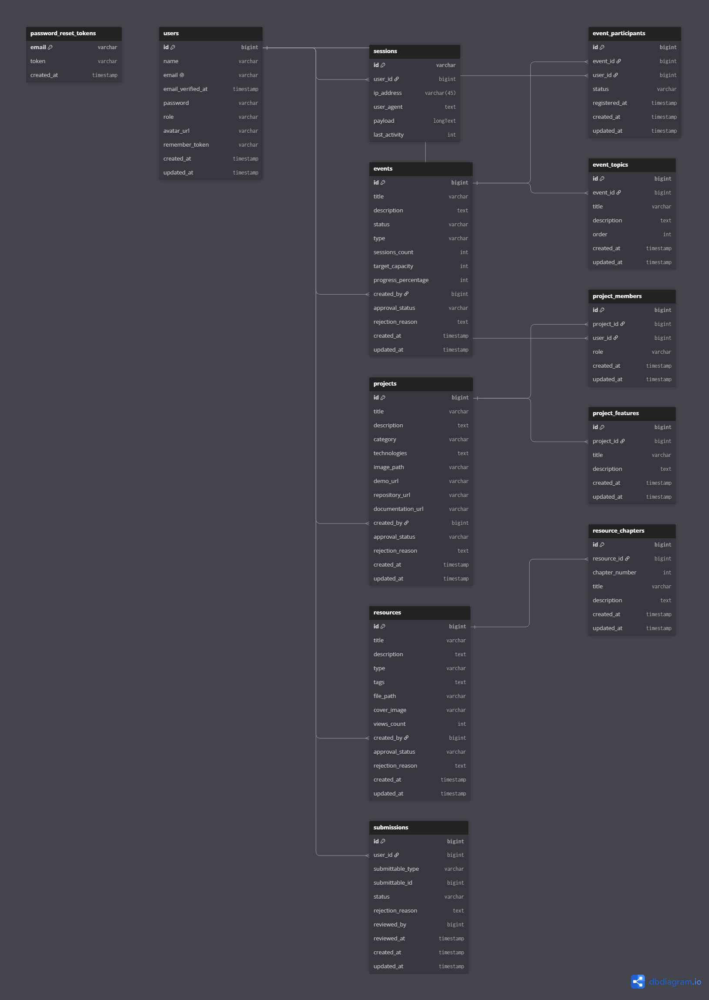

# Progress Hub

A **polyglot monorepo** for managing the Progress Hub platform — a community platform for UKM (student organization) events, projects, and learning resources.

## Project Structure

```
progress-hub/
├── apps/
│   ├── landing/        # Marketing & landing page (Next.js 16 + Tailwind CSS v4)
│   └── website/        # Main application (Laravel 13 + Tailwind CSS v4)
├── docker/             # Docker configurations
├── docs/               # Documentation & ERD
├── scripts/            # Utility scripts
└── .github/            # CI/CD workflows
```

## Tech Stack

| App | Stack |
|---|---|
| **Landing** | Next.js 16, React 19, Tailwind CSS v4, shadcn/ui, Framer Motion |
| **Website** | Laravel 13, PHP 8.3+, Blade Templates, Tailwind CSS v4, Vite, MySQL |

## Entity Relationship Diagram



### Database Tables

- **`users`** — Member and admin accounts (`role: 'admin' | 'member'`)
- **`events`** — Workshops, classes, hackathons, and seminars
- **`event_topics`** — Syllabus outline per event (1:N)
- **`event_participants`** — Member registration tracking (M:N pivot)
- **`projects`** — Student, UKM, and community projects
- **`project_members`** — Team member roles per project (M:N pivot)
- **`project_features`** — Key features per project (1:N)
- **`resources`** — Educational materials, articles, and tools
- **`resource_chapters`** — Chapter breakdown per resource (1:N)
- **`submissions`** — Member content submissions for admin approval (polymorphic)

## Getting Started

### Prerequisites

- [PHP](https://php.net/) >= 8.3 with SQLite extension
- [Composer](https://getcomposer.org/) >= 2.x
- [Node.js](https://nodejs.org/) >= 18.x

### Quick Start (Run Both Simultaneously)

From the monorepo root:

```bash
# Start both Landing (port 3000) and Website (port 8000)
npm run dev

# Or on Windows PowerShell:
.\dev.ps1

# Or double-click dev.bat
```

### Running Individually

```bash
# Landing Page only (http://localhost:3000)
npm run dev:landing

# Website (Laravel + Vite) only (http://localhost:8000)
npm run dev:web
```

### Database Note (SQLite)

The website backend is configured to use **SQLite** by default (`database/database.sqlite`). You do not need to install or run a MySQL server.

To re-seed or reset the database at any time:
```bash
cd apps/website
php artisan migrate:fresh --seed
```

### Default Accounts

| Role | Email | Password |
|---|---|---|
| Admin | `admin@progresshub.com` | `password` |
| Member | `ahmadfauzi@example.com` | `password` |

## CI/CD

GitHub Actions with path-based filtering:
- Changes to `apps/website/**` trigger website builds
- Changes to `apps/landing/**` trigger landing builds

## License

[MIT](LICENSE)
